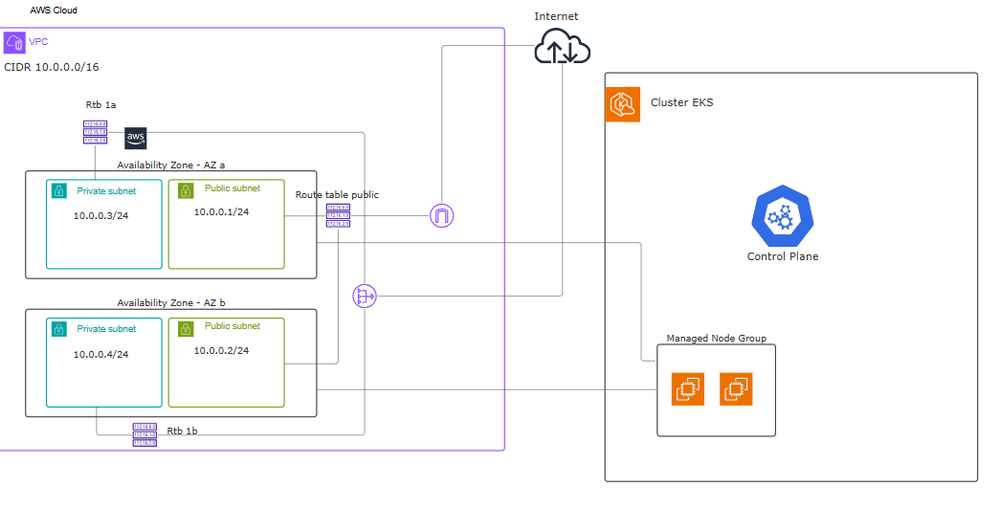

# CloudScript Technology DevOps Challenge

Este projeto provisiona na AWS um ambiente EKS + VPC + Node group funcionais. O projeto é modularizado, facilitando a reutilização dos recursos provisionados. São criados os seguintes recursos:

- VPC com subnets publicas e privadas em duas AZs, internet gateway e nat gateway para as subnets.
- EKS Cluster provisionado a partir de módulo local.
- Managed Node Group para satisfazer os worker nodes do cluster.

## Decisões técnicas

####  VPC

Foi utilizada a faixa de endereços 10.0.0.0/16 que permite uma disponibilidade maior de endereços IPs e subnets. Foram criadas subnets em duas AZs (obrigatorio para EKS) que permite tolerância a indisponibilidades de AZs. Subnets privadas para os Nós do EKS evitando exposicão a ataques e subnets publicas para serem acessadas diretamente pela internet (ex, LoadBalancers). Junto as subnets publicas foi associado um Internet Gateway (igw) para comunicação entre VPC e a internet e as subnets privadas foi associado um Nat Gateway para permitir a saida de recursos das subnets privadas
 
### EKS

Optei por não utilizar o módulo oficial da AWS, pois acredito que para este cenário a criação local permite melhor entendimento e clareza dos recursos que estão sendo associados e provisionados

### Managed Node Group

Seguindo a mesma lógica do módulo EKS, escolhi provisionar os nodes através de um módulo local.

### Recursos

Para melhor gerenciamento dos recursos foram utilizadas tags q permitem a identificação do projeto, time, ambiente e resource principal associado. 

## Arquitetura Planejada



## Estrutura do Projeto

O projeto foi organizado seguindo o princípio de Modularização, visando a reutilização de código e a separação de responsabilidades, que permite maior clareza sobre os recursos definidos no código

```text
.
├── modules/
│   ├── cluster-eks/          # Definição do Control Plane do Kubernetes e Roles de IAM
│   ├── managed-node-group/   # Configuração dos Worker Nodes
│   └── network/              # Camada de rede: VPC, Subnets, Gateways
├── modules.tf                # Arquivo principal que orquestra e chama os módulos locais
├── provider.tf               # Configuração dos provedores (AWS) e versões requeridas
├── variables.tf              # Declaração das variáveis de entrada do projeto
├── terraform.tfvars          # Definição dos valores para as variáveis
├── outputs.tf                # Exposição de dados relevantes 
├── README.md                 # Documentação do projeto e instruções de uso
├── LICENSE                   # Termos de licença do software
└── .gitignore                # Arquivos e diretórios ignorados pelo controle de versão
```
## Execução

Antes de qualquer comando, configure um backend, no caso deste projeto foi utilizado um bucket s3 para armazenamento remoto do estado. Se preferir pode utilizar outros backend. Se quiser continuar com s3 é necessario informar um bucket existente, se precisar crie um. No contexto atual do projeto, a configuração de backend se encontra no arquivo provider.tf

Certifique-se também que o provider esta instalado

```bash
terraform {
  required_providers {
    aws = {
      source  = "hashicorp/aws"
      version = "~>6.0"
    }
  }
}
```

Exemplo de backend remoto com s3:
```bash
backend "s3" {
    bucket = "SEU-BUCKET"
    key    = "KEY/terraform.tfstate"
    region = "SUA-REGIAO"
  }
  ```

Recomenda-se também que crie um arquivo terraform.tfvars para alteração dos valores default

Após configurado o backend execute os seguintes comandos:

Para inicializar os providers e módulos
```bash
terraform init 
```

Visualizar criação ou mudança de recursos a serem provisionados
```bash
terraform plan
```

Aplicar a criação dos recursos em nuvem
```bash
terraform apply
```

Após a criação dos recursos, copie o nome do cluster criado e configure kubectl para interagir com o cluster. É fundamental que aws-cli esteja instalado em sua máquina para execução deste comando.

```bash
aws eks update-kubeconfig --region us-east-1 --name CLUSTER_NAME
```


## Melhorias

Adicionar addons essenciais, como cert-manager, aws-load-balancer-controller, grafana-prometheus. Entregado uma solução mais completa e robusta. Adicionar novas AZs para aumentar o range de tolerância a falhas


<!-- BEGIN_TF_DOCS -->
## Requirements

| Name | Version |
|------|---------|
| <a name="requirement_aws"></a> [aws](#requirement\_aws) | ~>6.0 |

## Providers

No providers.

## Modules

| Name | Source | Version |
|------|--------|---------|
| <a name="module_eks_cluster"></a> [eks\_cluster](#module\_eks\_cluster) | ./modules/cluster-eks | n/a |
| <a name="module_eks_network"></a> [eks\_network](#module\_eks\_network) | ./modules/network | n/a |
| <a name="module_managed_node_group"></a> [managed\_node\_group](#module\_managed\_node\_group) | ./modules/managed-node-group | n/a |

## Resources

No resources.

## Inputs

| Name | Description | Type | Default | Required |
|------|-------------|------|---------|:--------:|
| <a name="input_aws_region"></a> [aws\_region](#input\_aws\_region) | AWS Region for resources deployment | `string` | `"us-east-1"` | no |
| <a name="input_cidr_block"></a> [cidr\_block](#input\_cidr\_block) | IPv4 CIDR block for VPC | `string` | `"10.0.0.0/16"` | no |
| <a name="input_ec2_type"></a> [ec2\_type](#input\_ec2\_type) | EC2 instance for managed node groups | `string` | `"t3.small"` | no |
| <a name="input_project_name"></a> [project\_name](#input\_project\_name) | Project name to identify VPC | `string` | `"devops-challenge"` | no |
| <a name="input_tags"></a> [tags](#input\_tags) | A map of tags to add to all resources. | `map(any)` | <pre>{<br>  "project": "devops-challenge",<br>  "team": "devops"<br>}</pre> | no |

## Outputs

| Name | Description |
|------|-------------|
| <a name="output_cluster_name"></a> [cluster\_name](#output\_cluster\_name) | Name of the EKS cluster to be used in kubeconfig |
| <a name="output_subnet_priv_1a"></a> [subnet\_priv\_1a](#output\_subnet\_priv\_1a) | Private subnet for EKS node group - az1 |
| <a name="output_subnet_priv_1b"></a> [subnet\_priv\_1b](#output\_subnet\_priv\_1b) | Private subnet for EKS node group - az2 |
| <a name="output_subnet_public_1a"></a> [subnet\_public\_1a](#output\_subnet\_public\_1a) | Public subnet for cluster EKS - az1 |
| <a name="output_subnet_public_1b"></a> [subnet\_public\_1b](#output\_subnet\_public\_1b) | Public subnet for cluster EKS - az2 |
<!-- END_TF_DOCS -->